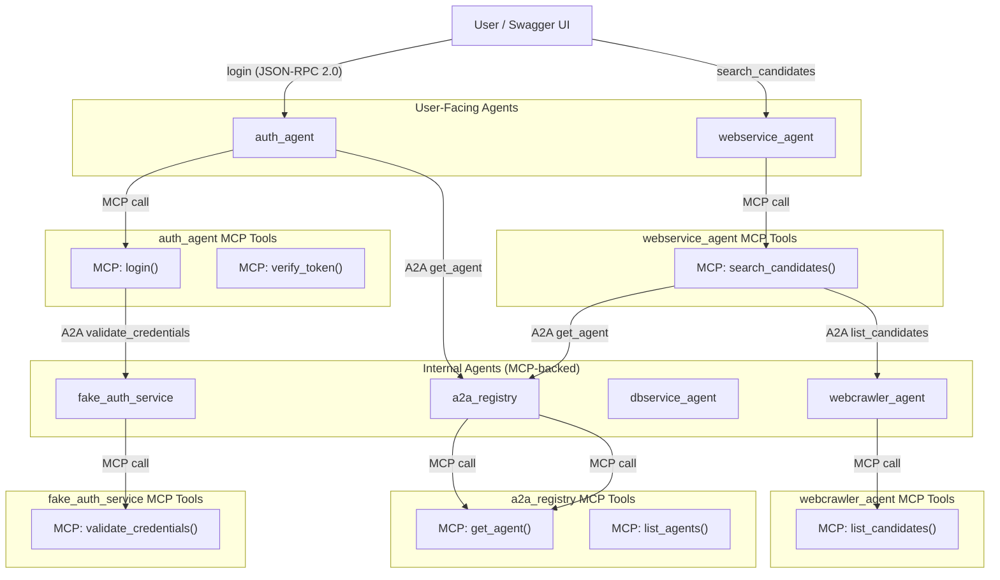

**Rebuild with clean cache:**

docker-compose down -v  # Remove containers and volumes
docker-compose build --no-cache  # Force fresh rebuild
docker-compose up -d

```css
platform-setup_repo/
├── auth_agent/
│   ├── main.py
│   ├── mcp_tools.py
│   ├── requirements.txt
│   ├── Dockerfile
│   └── logging_config.yml
├── webservice_agent/
│   ├── main.py
│   ├── mcp_tools.py
│   ├── requirements.txt
│   ├── Dockerfile
│   └── logging_config.yml
├── webcrawler_agent/
│   ├── main.py
│   ├── mcp_tools.py
│   ├── requirements.txt
│   ├── Dockerfile
│   └── logging_config.yml
├── dbservice_agent/
│   ├── main.py
│   ├── mcp_tools.py
│   ├── requirements.txt
│   ├── Dockerfile
│   └── logging_config.yml
├── fake_auth_service/
│   ├── main.py
│   ├── mcp_tools.py
│   ├── requirements.txt
│   ├── Dockerfile
│   └── logging_config.yml
├── a2a_registry/
│   ├── main.py
│   ├── mcp_tools.py
│   ├── requirements.txt
│   ├── Dockerfile
│   └── logging_config.yml
└── docker-compose.yml

```



```css
Service Name	Container Port	Host Port	Network Alias (Service Name)	URL in config.py (Default)	Expected Runtime URL (Inter-Container)	Status
auth_agent	8000	8100	auth_agent	http://auth_agent:8000/a2a	http://auth_agent:8000/a2a	Correct
webservice_agent	8000	8101	webservice_agent	http://webservice_agent:8000/a2a	http://webservice_agent:8000/a2a	Correct
dbservice_agent	8000	8102	dbservice_agent	http://dbservice_agent:8102/a2a	http://dbservice_agent:8000/a2a	Incorrect
fake_auth_service	8000	8103	fake_auth_service	(Not directly called by HRA)	http://fake_auth_service:8000/a2a	N/A
a2a_registry	8000	8104	a2a_registry	http://a2a_registry:8000/a2a (if used)	http://a2a_registry:8000/a2a	Correct
webcrawler_agent	8080	8106	webcrawler_agent	(Not directly called by HRA)	http://webcrawler_agent:8080/a2a	N/A
```

## Auth Agent Service (`auth_agent`)

**Role:** The Auth agent handles user authentication: it processes login requests and token verification. It uses an A2A JSON-RPC call to delegate credential validation to the `fake_auth_service`, and internally uses MCP-style functions to issue and verify tokens.

* **`POST /a2a`** – JSON-RPC 2.0 endpoint for authentication methods (`login`, `verify_token`).
* **`GET /health`** – Health check (returns simple status).

**Internal Logic (MCP-style):** The `auth_agent.mcp_tools` module provides `login(username, password)` and `verify_token(token)` functions. `login` uses the registry to discover the `fake_auth_service` endpoint and calls it via A2A JSON-RPC (method `validate_credentials`). If credentials are valid, it issues a token (for demo purposes, a simple UUID string) and returns it. The token is stored in-memory for subsequent verification. The `verify_token` function checks if a given token exists in the issued tokens store.

*Notes:* The Auth agent’s `login` method illustrates an  **A2A call** : it posts a JSON-RPC request to the `fake_auth_service`’s `/a2a` endpoint (discovered via the registry). The internal functions in `mcp_tools` abstract away these details, so the main JSON-RPC handler simply calls `mcp_tools.login()` or `mcp_tools.verify_token()`. This separation of concerns is analogous to MCP’s design (tools functions are defined separately from the model or API interface).

**`auth_agent/logging_config.yml`:** Logging configuration for Uvicorn and the app, ensuring each log line is prefixed with the service name (for structured logs).

## log_ingest_agent

This agent subscribes to a Pub/Sub subscription (that your Cloud Logging sink publishes to) and relays any received log entries to the router agent via an internal JSON-RPC call. It also provides a method to simulate dummy logs for testing the pipeline.

**Notes:** The `log_ingest_agent` starts a background Pub/Sub listener on startup. The `handle_message` callback will forward each log entry to the router and only acknowledge the Pub/Sub message if routing succeeds (so that on failure, the message can be retried). The `simulate_logs` function publishes one or more dummy log entries to the Pub/Sub topic (triggering the normal ingest flow) and is independent of any polling logic.

## log_router_agent

The router agent receives log entries (via the `/a2a` JSON-RPC endpoint) and determines where to send them. In our setup, all logs are forwarded to the BigQuery sink agent. The implementation can be extended with filtering or routing rules (e.g., based on log severity or source) if needed.


## Webservice Agent Service (`webservice_agent`)

**Role:** The Webservice agent provides a simple search interface for candidate data. It accepts search queries and returns matching candidate records. Internally, it uses a *mock data store* or can fetch records from the DB service via A2A. This demonstrates how one service can delegate data access to another, while focusing on the search logic.

* **`POST /a2a`** – JSON-RPC endpoint for search (`search_candidates` method).
* **`GET /health`** – Health check.

**Internal Logic:** `webservice_agent.mcp_tools` implements the `search_candidates(query: str)` function. For simplicity, this function calls the DB service’s A2A interface (`dbservice_agent`) to retrieve all candidate records, then filters them by the query string (e.g., matching name or skills). This shows an agent using another agent’s data via A2A instead of holding its own database.

**`webservice_agent/mcp_tools.py`:** Implements candidate search logic. It calls the DB service for data via A2A.

***Explanation**:* The Webservice agent doesn’t maintain its own database. Instead, its `search_candidates` tool uses the **A2A registry** to find the webcrawler service’s URL, then invokes `list_candidates` on the webcrawler service. This design allows the web agent to focus only on search logic, illustrating **agent interoperability via A2A** (one agent fetching data from another). The *MCP-style* function `search_candidates` encapsulates this process. (In a real scenario, each agent would publish an agent card describing its capabilities, which the registry uses to let them discover each other.)

* supports full JSON-RPC 2.0 `/a2a` endpoint
* Includes a Swagger UI–friendly `/search_candidates?title=...&skills=...` route for manual testing
* Internally delegates to MCP-style `mcp_tools.search_candidates(...)`
* Raises correct JSON-RPC error codes if methods are missing or input is invalid

## DB Service (`dbservice_agent`)

**Role:** The DB service acts as a simple data store for candidate records (in-memory for demo). It provides an A2A interface to create and retrieve records. This service has no direct UI; it’s called by other agents (like Webservice agent) via JSON-RPC.

* **`POST /a2a`** – JSON-RPC for data operations (`create_record`, `list_records`).
* **`GET /health`** – Health check.

**Internal Logic:** `dbservice_agent.mcp_tools` includes functions to manage candidate data:

* `create_record(name, skills)` – saves a new candidate record (returns an ID or success status).
* `list_records()` – returns all stored candidates.
* (We also implement `get_record(id)` internally for completeness, though not explicitly used by others in this example.)

The data structure can be a simple Python list or dict. For thread safety in a production scenario, one might use a proper database or synchronization, but for this example a module-level list is sufficient.

When the system starts, `_records` is empty. You can populate it via the `create_record` method (for example, by calling the DB service’s `/a2a` directly, or through another agent). For demonstration, we might call `create_record` a few times after startup to have some data for searching.

When the `save_candidates` node sends an A2A call to `dbservice_agent` via JSON-RPC, it should call:

```json
{
  "jsonrpc": "2.0",
  "method": "create_record",
  "params": {
    "name": "Alice Johnson",
    "title": "Data Scientist",
    "skills": ["Python", "ML", "TensorFlow"]
  },
  "id": 1
}

```

The MCP tool `create_record()` will store this in `candidates.db`.

## Fake Auth Service (`fake_auth_service`)

**Role:** The Fake Auth service simulates a user authentication backend. It exposes a JSON-RPC method `validate_credentials` (via `/a2a`) that returns whether a username/password pair is valid. The Auth agent uses this to verify user login attempts. In a real system, this might be replaced with a database or external authentication provider.

* **`POST /a2a`** – JSON-RPC for `validate_credentials`.
* **`GET /health`** – Health check.

**Internal Logic:** `fake_auth_service.mcp_tools` implements a simple credentials check. For example, it may accept one hard-coded username/password (or a small user dictionary). If credentials match, it returns `True`, otherwise `False`. This is kept simple for demonstration.

## A2A Registry Service (`a2a_registry`)

**Role:** The registry service acts as a discovery mechanism for agents. It maintains a list of static **Agent Cards** (one for each service) in a SQLite database. An *Agent Card* is a JSON profile describing an agent’s name, capabilities, and endpoint URL. The registry provides JSON-RPC methods for retrieving an agent’s info or listing all agents.

* **`POST /a2a`** – JSON-RPC interface with methods:
  * `get_agent(name)` – returns the agent card for the given agent name.
  * `list_agents()` – returns a list of all agent cards.
* **`GET /health`** – Health check.

**Internal Logic:** On startup, the registry service creates (or opens) a local SQLite database file and ensures a table for agent cards exists. It then inserts predefined agent entries (name, description, URL, and methods/capabilities). These could be fetched from a config or environment, but for simplicity, they are hard-coded. The `mcp_tools` functions use `sqlite3` to query this database:

* `get_agent(name)` – SELECT the agent’s card JSON from the table and return it as a dict.
* `list_agents()` – SELECT all agent cards and return as a list.

This lets other agents discover each other’s endpoints. In our system, both Auth and Webservice agents use the registry to find the URLs for `fake_auth_service` and `dbservice_agent` respectively. (Alternatively, they could be configured with known URLs, but using a registry illustrates the A2A discovery process.)

The registry’s `init_database` runs on startup (via FastAPI’s event handler) to ensure the data is ready. We use the **well-known agent names** (which correspond to service names in Docker Compose) and their internal network URLs. In a real A2A network, the agent card might be accessible at a public `.well-known/agent.json` URL, but here our registry centralizes that information.

## Running the Platform

With all files in place, you can start the system by running:

```bash
docker-compose up --build
```

**Health Check:** You can verify all services are up with health endpoints. For example:

```bash
curl -X GET http://localhost:8100/health     # Auth agent health
curl -X GET http://localhost:8104/health     # Registry health
```

**Example JSON-RPC Calls:** Below are sample `curl` commands to demonstrate A2A interactions:

1. **Login via Auth Agent** (which calls Fake Auth Service internally):

   ```bash
   curl -X POST http://localhost:8100/a2a \
        -H "Content-Type: application/json" \
        -d '{
              "jsonrpc": "2.0",
              "method": "login",
              "params": { "username": "admin", "password": "secret" },
              "id": 1
            }'

   ```

   Expected response (JSON-RPC result):

   ```bash
   {
     "jsonrpc": "2.0",
     "result": { "success": true, "token": "<some-uuid>" },
     "id": 1
   }

   ```

   If credentials are wrong, `"success": false` with an error message is returned.

   *(The Auth agent used A2A to validate credentials and then issued a token.)*
2. **Verify Token via Auth Agent** (after obtaining a token):

   ```bash
   curl -X POST http://localhost:8100/a2a \
        -H "Content-Type: application/json" \
        -d '{
              "jsonrpc": "2.0",
              "method": "verify_token",
              "params": { "token": "<token-from-login>" },
              "id": 2
            }'

   ```

   Expected result if valid:

   ```bash
   { "jsonrpc": "2.0", "result": true, "id": 2 }

   ```

   If the token wasn’t issued or is invalid: `false`.
3. **Create a Candidate via DB Service:** (So we have data to search)

   ```bash
   curl -X POST http://localhost:8102/a2a \
        -H "Content-Type: application/json" \
        -d '{
              "jsonrpc": "2.0",
              "method": "create_record",
              "params": { "name": "Alice", "skills": ["python", "fastapi"] },
              "id": 1
            }'

   ```

   Response:

   ```bash
   { "jsonrpc": "2.0", "result": { "success": true, "id": 1 }, "id": 1 }

   ```

   Repeat for a couple more records (changing name/skills and maybe id will auto-increment). You can also call `list_records` similarly to see all records.
4. **Search via Webservice Agent:** (The webservice will call DB service’s `list_records` internally to get data and filter it)

   ```bash
   curl -X POST http://localhost:8101/a2a \
        -H "Content-Type: application/json" \
        -d '{
              "jsonrpc": "2.0",
              "method": "search_candidates",
              "params": { "query": "python" },
              "id": 1
            }'

   ```

   If "Alice" (created above) has "python" in skills, she should appear in results:

   ```json
   {
     "jsonrpc": "2.0",
     "result": { "results": [ { "id": 1, "name": "Alice", "skills": ["python","fastapi"] } ] },
     "id": 1
   }

   ```

   The webservice agent’s output is derived from the DB service’s data, showing the **multi-agent coordination** in action.
5. **Using the Registry directly:** You can query the registry for an agent’s card or list all agents:

   ```bash
   # Get the auth_agent's card
   curl -X POST http://localhost:8104/a2a \
        -H "Content-Type: application/json" \
        -d '{
              "jsonrpc": "2.0",
              "method": "get_agent",
              "params": { "name": "auth_agent" },
              "id": 1
            }'

   ```

   This returns the stored metadata for `auth_agent` (name, description, URL, methods).

   Similarly, `method: "list_agents"` with no params will return an array of all agent cards.

Each service’s `/a2a` endpoint strictly follows **JSON-RPC 2.0** conventions, expecting a `"jsonrpc": "2.0"` field and responding with the same format. This consistent interface is what allows agents to call each other seamlessly using HTTP POST and JSON payloads. Meanwhile, the **MCP-style internal tools** (the functions in `mcp_tools.py`) let each agent encapsulate its logic (whether it’s token handling, search, database operations, etc.) behind the JSON-RPC interface.

By combining these, we achieve a clean separation: **A2A for inter-agent communication** (like remote procedure calls between independent AI agents), and  **MCP-like patterns for internal processing** . In practice, an LLM-driven agent could use MCP to decide when to call these tools or delegate tasks to other agents via A2A, enabling complex multi-agent workflows in a standardized way.
